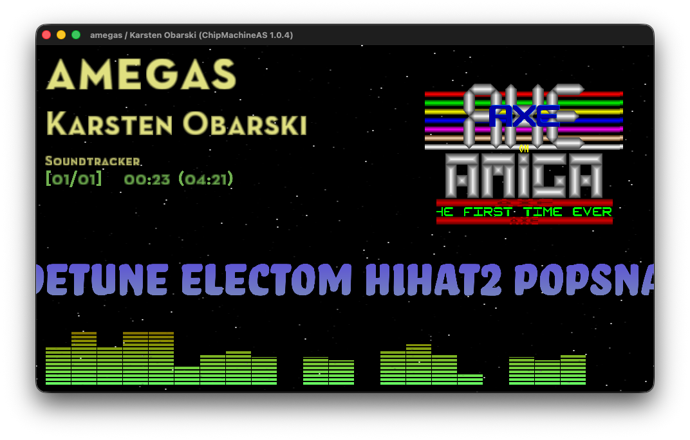

**ChipMachineAS**

<div align="right">
  
</div>

**Port of ChipMachine for Apple Silicon.**


> ChipMachine is my favorite Mac retro chiptune player and I have been using it forever. However, when opening it on my Mac after a recent macOS update, I saw this annoying popup above. It upset me and I channeled that anger into this project.

---

[](https://www.youtube.com/watch?v=Akn8Grtb9QY)

## Intro

*A demoscene/retro Jukebox/spotify-like music player*

* **Intructions are dead simple:**
* **Start typing to incrementally search aggregated database**
* **UP/DOWN keys = select a song from search results**
* **ENTER key = play**
* **TAB key = help screen**
* **(Read the scrolling text for more info)**
* **[Things in progress / to come](data/misc/TOODOO.txt)**
* **Ultimate goal: every chiptune searchable and instantly playable!** 

## Binaries

Binaries for macOS (tested on Tahoe) are available under *Releases*

**NOTE it should work on pre-Tahoe macOS however I have no means to test it**

https://github.com/mihailod/chipmachine/releases

### Running on Mac (Gatekeeper Authorization)

The app is distributed with an ad-hoc code signature and macOS Gatekeeper will block it.

This is standard behavior for open-source binaries distributed outside the official Mac App Store ecosystem.

To authorize and run the application on your Mac, follow these steps:

1. Download the latest release and unzip it in the Applications folder
2. Double-click `ChipMachineAS.app`.
3. macOS will display a prompt stating the app cannot be opened because the developer cannot be verified.
4. Click **Done** or **Cancel**.
5. Open your Mac's **System Settings**.
6. Navigate to **Privacy & Security** in the left sidebar
7. Scroll down to the **Security** section.
8. Look for the notification stating: `“ChipMachineAS” was blocked from use because it is not from an identified developer.`
9. Click the **Open Anyway** button.
10. Authenticate using your Mac's admin password or Touch ID.
11. Double-click `ChipMachineAS.app` again.
12. The final confirmation prompt will appear.
13. Click **Open**.

*Note: You only need to perform this authorization once. Subsequent launches will boot instantly.*

## Prerequisites for development (Tested on macOS 26 / Tahoe only)

* Make sure you have Homebrew installed (Apple Silicon homebrew in /opt/homebrew/ , make sure you are not using Intel legacy /usr/local tools)
* brew install git cmake ninja freetype glew glfw3 lua fftw mpg123 python ffmpeg
* (if some packages are reported missing later install then via brew and let me know -- I missed them in the line above!)

## Building for Apple Silicon

```bash
mkdir chipmachine-as && cd chipmachine-as
git clone https://github.com/mihailod/chipmachine.git
git clone https://github.com/mihailod/apone.git
git clone https://github.com/mihailod/musicplayer.git
git clone https://github.com/mihailod/vice310.git
git clone https://github.com/mihailod/98fmplayer.git
git clone https://github.com/mihailod/libpxtone.git
git clone https://github.com/mihailod/organya.h.git organya
git clone https://github.com/mihailod/eupmini.git
git clone https://github.com/mihailod/zingzong.git
git clone --recursive https://github.com/mihailod/libkss.git
mkdir build && cd build
cmake ../chipmachine -GNinja -DCMAKE_BUILD_TYPE=Release
ninja
```

* Running the app from the build folder: ./chipmachine (-h for all options)
* Packaging the app: [package_app.sh](package_app.sh)
* Database update info: [scripts/DB_UPDATE_PROCESS.txt](scripts/DB_UPDATE_PROCESS.txt)
* AI tools used to help with the porting: Claude, Gemini, Antigravity, Codex

## Using the application

* Type words separated by spaces for incremental search
* *ENTER* to play, *SHIFT-ENTER* to enque
* *F1* = Player screen, *F2* = Search screen
* *F5* = Play/Pause
* *F9* = Advanced search: set/reset search filter by platform (ie. Amiga)
* *F6* = Next Song (or *ENTER* from Player Screen)
* *ESC* = Clear search field
* *SHIFT-ESC* = Quit
* *F7* = Toggle Favorite
* Type _shoutcast_ to see the radio-stations
* [Things in progress / to come](data/misc/TOODOO.txt)

## Data Sources

### Music Collections

* Modland - https://ftp.modland.com
* High Voltage SID collection - https://www.hvsc.c64.org
* Gamebase64 - http://www.gb64.com
* AMP (Amiga Music Preservation) - http://amp.dascene.net
* Amiga remix - http://amigaremix.com
* RKO - http://remix.kwed.org
* Atari ST (SNDH) - http://sndh.atari.org
* SNES Music - http://snesmusic.org
* Atari SAP (ASMA) - http://asma.atari.org
* HVTC (High Voltage TED Collection) - http://plus4world.powweb.com
* NSFE (Famicompo mini NSFE archive of 1,228 songs from https://forums.nesdev.org/viewtopic.php?t=21128)
* Sounds of Scenesat - https://scenesat.com
* AmigaVibes - http://www.amigavibes.org
* Demovibes - https://www.demovibes.org

### Demo databases

* Pouet - https://www.pouet.net (production soundtracks streamed from YouTube)
* Bitworld - http://janeway.exotica.org.uk
* CSDb - https://csdb.dk

### Podcasts

* Syntax Error - http://www.syntaxerror.nu
* C64 Take Away - http://c64takeaway.com

### Shoutcast Radio Streams

* Scenesat - https://scenesat.com
* SLAY Radio - https://www.slayradio.org
* Nectarine - https://scenestream.net
* VGM Radio - http://vgmradio.com
* NoLife-Radio - https://www.nolife-radio.com
* Rainwave - https://rainwave.cc
* The Sid Station - https://c64radio.com
* Radio PARALAX - https://www.radio-paralax.de
* CVGM Radio - https://radio.cvgm.net

## Music Plugins (Supported formats)

### OpenMPT

Support for Amiga tracker formats

* ProTracker, ScreamTracker III, FastTracker II, Impulse Tracker, OpenMPT, ScreamTracker II, NoiseTracker, Soundtracker, Mod's Grave, UltraTracker, Composer 669 / UNIS 669, MultiTracker, OctaMed, Farandole Composer, DigiTracker, Extreme's Tracker, Velvet Studio, DSIK Format, DSMI, ASYLUM, Oktalyzer, X-Tracker, PolyTracker, Epic Megagames, MASI, MadTracker 2, DigiBooster Pro, DigiBooster, Imago Orpheus, Galaxy Sound System

Extensions: `.mod` `.xm` `.it` `.s3m` `.mptm` `.stm` `.nst` `.m15` `.stk` `.wow` `.ult` `.669` `.mtm` `.med` `.far` `.mdl` `.ams` `.dsm` `.amf` `.okt` `.dmf` `.mt2` `.dbm` `.digi` `.imf` `.j2b` `.gdm` `.umx` `.mo3` (and other formats reported by libopenmpt)

### High Technology

Support for Dreamcast and Sega Saturn music

Extensions: `.ssf` `.dsf` `.minissf` `.minidsf`

### Highly Experimental

Support for Playstation 1 & 2 music

Extensions: `.psf` `.psf2` `.minipsf` `.minipsf2`

### NDS

Support for Nintendo DS music

Extensions: `.2sf` `.mini2sf`

### Game Music Emulator

Support for various 8 bit console music

* ZX Spectrum, Amstrad CPC, Nintendo Game Boy, Sega Genesis, Mega Drive, NEC TurboGrafx-16, PC Engine, MSX Home Computer, other Z80 systems, Nintendo NES, Famicom (with VRC 6, Namco 106, and FME-7 sound), Atari systems using POKEY sound chip, Super Nintendo, Super Famicom, Sega Master System, Mark III, Sega Genesis, Mega Drive, BBC Micro

Extensions: `.spc` `.nsf` `.nsfe` `.gbs` `.ay` `.gym` `.sap` `.vgm` `.vgz` `.hes` `.kss` `.sgc` `.emul`

### SC68

Support for Atari 16 bit music

Extensions: `.sc68` `.sndh` `.snd` `.4v`

### USF

Support for Nintendo 64 music

Extensions: `.usf` `.miniusf`

### StSound

Support for Atari ST music (older formats)

Extensions: `.ym` `.mix`

### ADplug

Support for retro audio format hardware simulation

* AdLib Tracker 2 by subz3ro, 
Westwood ADL File Format, 
AMUSIC Adlib Tracker by Elyssis, 
Bob's Adlib Music Format, 
BoomTracker 4.0 by CUD, 
Creative Music File Format by Creative Technology, 
EdLib by Vibrants, 
Digital-FM by R.Verhaag, 
Twin TrackPlayer by TwinTeam, 
DOSBox Raw OPL Format, 
DeFy Adlib Tracker by DeFy, 
HSC Adlib Composer by Hannes Seifert, HSC-Tracker by Electronic Rats, 
HSC Packed by Number Six / Aegis Corp., 
Apogee IMF File Format, 
Ken Silverman's Music Format, 
LucasArts AdLib Audio File Format by LucasArts, 
LOUDNESS Sound System, 
igin AdLib Music Format, 
Mlat Adlib Tracker, 
MIDI Audio File Format, 
MKJamz by M \ K Productions (preliminary), 
AdLib MSCplay, 
MPU-401 Trakker by SuBZeR0, 
Reality ADlib Tracker by Reality, 
RdosPlay RAW file format by RDOS, 
Softstar RIX OPL Music Format, 
AdLib Visual Composer by AdLib Inc., 
Screamtracker 3 by Future Crew, 
Surprise! Adlib Tracker 2 by Surprise! Productions, 
Surprise! Adlib Tracker by Surprise! Productions, 
Sierra's AdLib Audio File Format, 
SNGPlay by BUGSY of OBSESSION, 
Faust Music Creator by FAUST, 
Adlib Tracker 1.0 by TJ, 
eXotic ADlib Format by Riven the Mage, 
XMS-Tracker by MaDoKaN/E.S.G, 
eXtra Simple Music by Davey W Taylor, 

Extensions: `.a2m` `.adl` `.amd` `.bam` `.cff` `.cmf` `.d00` `.dfm` `.dmo` `.dro` `.dtm` `.hcs` `.hsp` `.imf` `.ksm` `.laa` `.lds` `.m` `.mad` `.mid` `.mkj` `.msc` `.mtk` `.rad` `.raw` `.rix` `.rol` `.as3m` `.sa2` `.sat` `.sci` `.agd` `.sdb` `.xad` `.xms` `.xsm` `.hsc` `.edl` `.mtr` `.adlib` `.sqx`

### MP3

Support for MP3 music

Extensions: `.mp3`

### Vice

Support for Commodore C64 music (mono and stereo SID)

Extensions: `.sid` `.mus` `.str`

### Hively

Support for AHX and HVL amiga music

Extensions: `.ahx` `.hvl`

### RSN

Support for RAR packed music (primarily SNES)

Extensions: `.rsn` `.rps` `.rdc` `.rds` `.rgs` `.r64`

### Ayfly

Support for various ZX Spectrum formats

Extensions: `.ay` `.psg` `.asc` `.stc` `.psc` `.sqt` `.stp` `.stp2` `.pt1` `.pt2` `.pt3` `.ftc` `.vtx` `.vt2` `.zxs` `.st13`

### MDX

Support for the Sharp X68000 Music Macro Language

Extensions: `.mdx` (with optional `.pdx` sample banks)

### FMP

Support for NEC PC-98 FMP driver Including the OPNA hardware-rhythm drums

Extensions: `.opi` `.ovi` `.ozi`

### PxTone

Support for PxTone Collage music by Studio Pixel

Extensions: `.ptcop` `.pttune`

### Organya

Support for Organya music by Studio Pixel

Extensions: `.org`

### SunVox

Support for SunVox music by Alexander Zolotov (NightRadio)

Extensions: `.sunvox`

### Euphony

Support for Euphony music (FM Towns / PC-98)

Extensions: `.eup`

### MSX

Support for MSX music

Extensions: `.mgs` `.bgm` `.opx` `.mpk` `.mbm`

### S98

Support for retro hardware Music, including OPNA hardware-rhythm drums

Extensions: `.s98`

### AudioOverload

Support for Sega Saturn and Capcom Q music

Extensions: `.ssf` `.minissf` `.qsf` `.miniqsf` `.spu`

### GSF

Support for Gameboy Advance music

Extensions: `.gsf` `.minigsf`

### UADE

Support for Amiga exotic (Delitracker) formats

* ActionAmics AbyssHighestExperience ADPCM-mono AM-Composer AMOS ArtAndMagic Alcatraz-Packer ArtOfNoise-4V ArtOfNoise-8V AudioSculpture BeathovenSynthesizer BenDaglish BenDaglish-SID BladePacker ChipTracker Cinemaware CoreDesign custom CustomMade DariusZendeh DaveLowe DaveLowe-Deli DaveLoweNew DavidHanney DavidWhittaker DeltaMusic2.0 DeltaMusic1.3 Desire DIGI-Booster DigitalSonixChrome DigitalSoundStudio DynamicSynthesizer EMS EMS-6 FashionTracker FutureComposer1.3 FutureComposer1.4 Fred FredGray FutureComposer-BSI FuturePlayer ForgottenWorlds-Game GlueMon EarAche HowieDavies JochenHippel-CoSo QuadraComposer ImagesMusicSystem Infogrames InStereo InStereo2.0 JamCracker JankoMrsicFlogel JasonBrooke JasonPage JasonPage-JP JeroenTel JesperOlsen JochenHippel JochenHippel-7V Jochen-Hippel-ST KrisHatlelid Laxity LegglessMusicEditor ManiacsOfNoise MagneticFieldsPacker MajorTom Mark-Cooksey Mark-Cooksey-Old MarkII MartinWalker Maximum-Effect MCMD MED Medley MIDI-Loriciel MikeDavies MMDC Mugician MugicianII MusicAssembler MusicMaker-4V MusicMaker-8V MultiMedia-Sound NovoTradePacker NTSP-system Octa-MED Oktalyzer onEscapee PaulRobotham PaulShields PaulSummers PeterVerswyvelen PierreAdane ProfessionalSoundArtists PTK-Prowiz PumaTracker RichardJoseph RiffRaff RobHubbard RobHubbardOld Lionheart-Game SCUMM SeanConnolly SeanConran SIDMon1.0 SIDMon2.0 Silmarils SonicArranger SonicArranger-pc-all SonixMusicDriver SoundProgrammingLanguage SoundControl SoundFactory Sound-FX SoundImages SoundMaster SoundMon2.0 SoundMon2.2 SoundPlayer Special-FX Special-FX-ST SpeedyA1System SpeedySystem SteveBarrett SteveTurner SUN-Tronic Synth SynthDream SynthPack SynTracker TFMX TFMX-1.5-TFHD TFMX-7V TFMX-7V-TFHD TFMX-Pro TFMX-Pro-TFHD TFMX-ST ThomasHermann TimFollin TheMusicalEnlightenment TomyTracker Tronic UFO UltimateSoundtracker VoodooSupremeSynthesizer WallyBeben YM-2149 MusiclineEditor Soundtracker-IV Sierra-AGI DirkBialluch Quartet Quartet-PSG Quartet-ST 

Extensions (matched as a filename prefix or suffix): `.smod` `.lion` `.okta` `.sid` `.ymst` `.sps` `.spm` `.jb` `.ast` `.ahx` `.thx` `.adpcm` `.amc` `.nt` `.abk` `.aam` `.alp` `.aon` `.aon4` `.aon8` `.adsc` `.mod_adsc4` `.bss` `.bd` `.BDS` `.uds` `.kris` `.cin` `.core` `.cus` `.cust` `.custom` `.cm` `.rk` `.rkb` `.dz` `.mkiio` `.dl` `.dl_deli` `.dln` `.dh` `.dw` `.dwold` `.dlm2` `.dm2` `.dlm1` `.dm1` `.dsr` `.db` `.digi` `.dsc` `.dss` `.dns` `.ems` `.emsv6` `.ex` `.fc13` `.fc3` `.fc` `.fc14` `.fc4` `.fred` `.gray` `.bfc` `.bsi` `.fc-bsi` `.fp` `.fw` `.glue` `.gm` `.ea` `.mg` `.hd` `.hipc` `.soc` `.emod` `.qc` `.ims` `.dum` `.is` `.is20` `.jam` `.jc` `.jmf` `.jcb` `.jcbo` `.jpn` `.jpnd` `.jp` `.jt` `.mon_old` `.jo` `.hip` `.mcmd` `.sog` `.hip7` `.s7g` `.hst` `.kh` `.powt` `.pt` `.lme` `.mon` `.mfp` `.hn` `.mtp2` `.thn` `.mc` `.mcr` `.mco` `.mk2` `.mkii` `.avp` `.mw` `.max` `.mcmd_org` `.med` `.mmd0` `.mmd1` `.mmd2` `.mso` `.midi` `.md` `.mmdc` `.dmu` `.mug` `.dmu2` `.mug2` `.ma` `.mm4` `.mm8` `.mms` `.ntp` `.two` `.octamed` `.okt` `.one` `.dat` `.ps` `.snk` `.pvp` `.pap` `.psa` `.mod_doc` `.mod15` `.mod15_mst` `.mod_ntk` `.mod_ntk1` `.mod_ntk2` `.mod_ntkamp` `.mod_flt4` `.mod` `.mod_comp` `.!pm!` `.40a` `.40b` `.41a` `.50a` `.60a` `.61a` `.ac1` `.ac1d` `.aval` `.chan` `.cp` `.cplx` `.crb` `.di` `.eu` `.fc-m` `.fcm` `.ft` `.fuz` `.fuzz` `.gmc` `.gv` `.hmc` `.hrt` `.hrt!` `.ice` `.it1` `.kef` `.kef7` `.krs` `.ksm` `.lax` `.mexxmp` `.mpro` `.np` `.np1` `.np2` `.noisepacker2` `.np3` `.noisepacker3` `.nr` `.nru` `.ntpk` `.p10` `.p21` `.p30` `.p40a` `.p40b` `.p41a` `.p4x` `.p50a` `.p5a` `.p5x` `.p60` `.p60a` `.p61` `.p61a` `.p6x` `.pha` `.pin` `.pm` `.pm0` `.pm01` `.pm1` `.pm10c` `.pm18a` `.pm2` `.pm20` `.pm4` `.pm40` `.pmz` `.polk` `.pp10` `.pp20` `.pp21` `.pp30` `.ppk` `.pr1` `.pr2` `.prom` `.pru` `.pru1` `.pru2` `.prun` `.prun1` `.prun2` `.pwr` `.pyg` `.pygm` `.pygmy` `.skt` `.skyt` `.snt` `.snt!` `.st2` `.st26` `.st30` `.star` `.stpk` `.tp` `.tp1` `.tp2` `.tp3` `.un2` `.unic` `.unic2` `.wn` `.xan` `.xann` `.zen` `.puma` `.rjp` `.sng` `.riff` `.rh` `.rho` `.sa-p` `.scumm` `.s-c` `.scn` `.scr` `.sid1` `.smn` `.sid2` `.mok` `.sa` `.sonic` `.sa_old` `.smus` `.snx` `.tiny` `.spl` `.sc` `.sct` `.psf` `.sfx` `.sfx13` `.tw` `.sm` `.sm1` `.sm2` `.sm3` `.smpro` `.bp` `.sndmon` `.bp3` `.sjs` `.jd` `.doda` `.sas` `.ss` `.sb` `.jpo` `.jpold` `.sun` `.syn` `.sdr` `.osp` `.st` `.synmod` `.tfmx1.5` `.tfhd1.5` `.tfmx7V` `.tfhd7V` `.mdat` `.tfmxpro` `.tfhdpro` `.tfmx` `.mdst` `.thm` `.tf` `.tme` `.sg` `.dp` `.trc` `.tro` `.tronic` `.ufo` `.mod15_ust` `.vss` `.wb` `.ym` `.ml` `.mod15_st-iv` `.agi` `.tpu` `.qpa` `.sqt` `.qts` `.ftm` `.sdata` `.dux`

### TedPlay

Support for Plus/4 music

Extensions: `.prg`

### FFMpeg

Support for streaming audio

* AAC
* Ogg/Vorbis

Extensions: `.m4a` `.aac` `.mp3` `.mp4`

### V2

Support for Farbrausch V2 Synthesizer System modules

Extensions: `.v2` `.v2m`

### YouTube

Streams audio directly from YouTube links (`youtube.com/` / `youtu.be/`). The bundled `yt-dlp` resolves the best audio stream, which is then played back via FFMpeg. This is how the Pouet database plays demoscene production soundtracks. `yt-dlp` ships with the app (`bin/ytdlp/`), so no extra setup is required.

---

## **Credits**

This is mostly a preservation effort. I am making this project for myself so I am able to continue enjoying listening to my favorite music in a clean and inspirational way the original Chipmachine was providing to me over many many years.

My work here is mostly based around:

* **Porting**: from Intel to ARM
* **Integration**: with / adding of various new plugins that did not exist in Intel version
* **Content curation**: updating / adding more songs and fixing their metadata from various databases)
* **Administration**: maintenance, releasing, pull requests merging, support, promoting

**I don't take or imply any credit for the original idea and implementation and actual players development (the hardest part IMO).**

Here is the attribution for the individual emulators, audio players, plugins, and core sub-routines utilized across this project sofar:

* **OpenMPT (Tracker Formats):** Developed by the OpenMPT Project Team (originally founded by Olivier Lapicque). Licensed under BSD-3-Clause.
* **GME / Game Music Emulator (Console Formats):** Developed by Shay Green. Licensed under LGPL-2.1-or-later.
* **VICE (C64/SID emulation):** Developed by the VICE Core Team. Licensed under GPL-2.0-or-later.
* **UADE (Amiga Exotic formats):** Developed by Heikki Orsila and the UADE Team. Licensed under GPL-2.0-or-later.
* **StSound (Atari ST YM2149):** Developed by Arnaud Carré (Leonard/Oxygene). Licensed under MIT.
* **SC68 (Atari ST/Amiga):** Developed by Benjamin Gerard. Licensed under GPL-3.0-or-later.
* **AdPlug (PC AdLib/OPL):** Developed by Simon Peter and the AdPlug Team. Licensed under LGPL-2.1-or-later.
* **Highly Experimental / PSF1/2:** Developed by Neill Corlett. Licensed under zlib License.
* **AudioOverload Backend / AOSDK:** Developed by Richard Bannister and contributors. Licensed under Custom/Freeware permissive license.
* **HivelyTracker (AHX/HVL):** Developed by IRIS (Peter "Yohng" V, Curt Cool). Licensed under BSD-3-Clause.
* **MDX / S98 (PC-98 & Sharp X68000):** Emulation engines adapted from OpenMSX/GME variants. Licensed under GPL-2.0-or-later.
* **Ayfly (ZX Spectrum AY-3-8910):** Developed by Sergey Vladimirov. Licensed under GPL-2.0-or-later.
* **98fmplayer:** Developed by areis. Licensed under MIT.
* **libkss (MSX KSS):** Developed by Mitsutaka Okazaki. Licensed under MIT.
* **organya (Cave Story Organya format):** Developed by Studio Pixel (Daisuke Amaya). Portions adapted under MIT / Open Source.
* **libpxtone (PixelTone audio):** Developed by Studio Pixel (Daisuke Amaya). Licensed under MIT.
* **eupmini (PC-98 EUP audio):** Developed by various retro-computing contributors. Licensed under MIT.
* **minimp3 (MP3 decoding):** Developed by Lieven van den Hauwe. Licensed under CC0-1.0 (Public Domain).
* **Sol3 / Pybind11 / fmt (Core Infrastructure):** Developed by The Sol3/Pybind11/fmt Maintainers. Licensed under MIT.
* **Freetype / Grappix (UI & Text):** Developed by The FreeType Project and Grappix contributors. Licensed under FTL / BSD-2-Clause.
* **zingzong (Atari ST Quartet format):** Developed by Ben G. (benjihan). Licensed under MIT.

---

## Licensing

Chipmachine is a combined work distributed under the [`GNU General Public License v3.0`](./LICENSE) 
(or at your option, any later version) due to its underlying emulation dependencies.

* **Original Program, Core Architecture:** Copyright (c) 2022 Jonas Minnberg. Licensed under the MIT License.
* **Apple Silicon Port, Additional Plugins, Database Enhancements:** Copyright (c) 2026 Mihailo Despotović. Licensed under the MIT License.
* **Atari ST/Amiga Emulation (SC68):** Licensed under GPL-3.0-or-later (forces overall project license).
* **C64/A500 Emulation (VICE, UADE):** Licensed under GPL-2.0-or-later.
* **Other Components:** See the [`LEGAL`](./LEGAL) file for a complete matrix of MIT, BSD, and LGPL dependencies.
