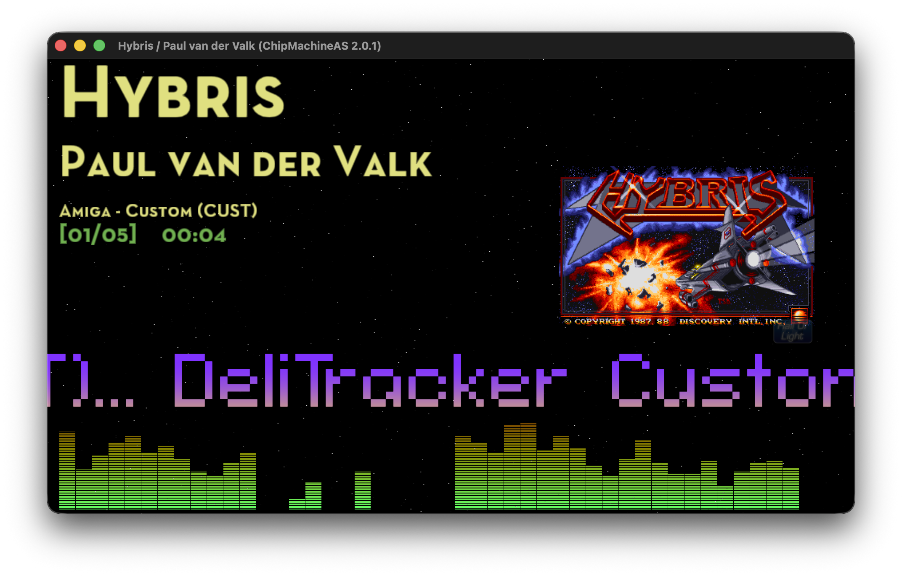
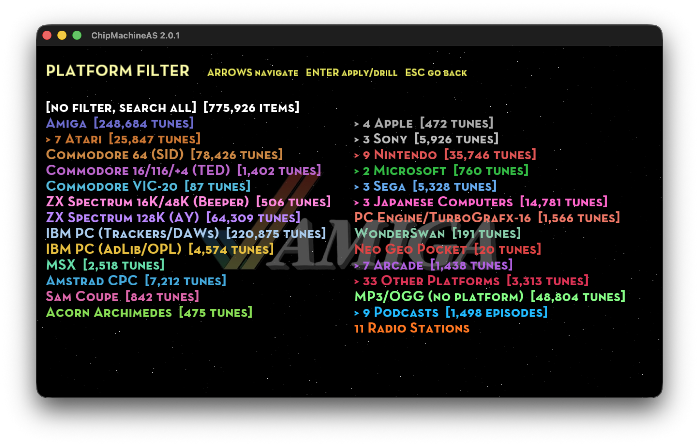
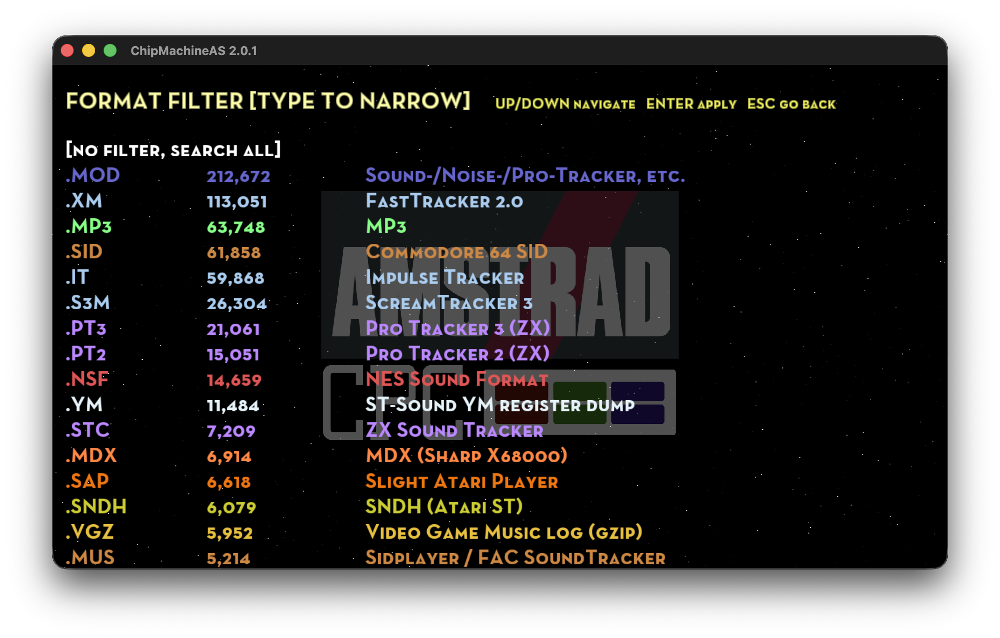
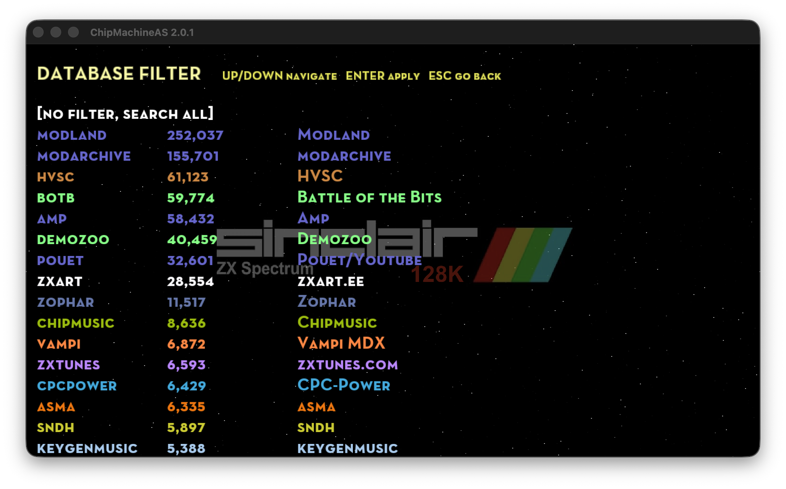
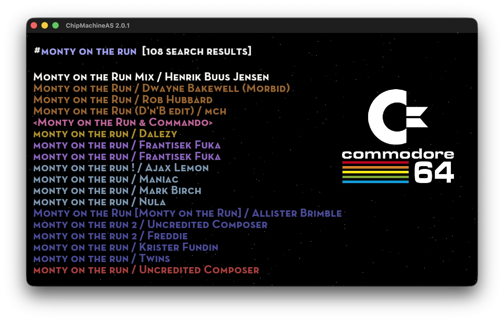
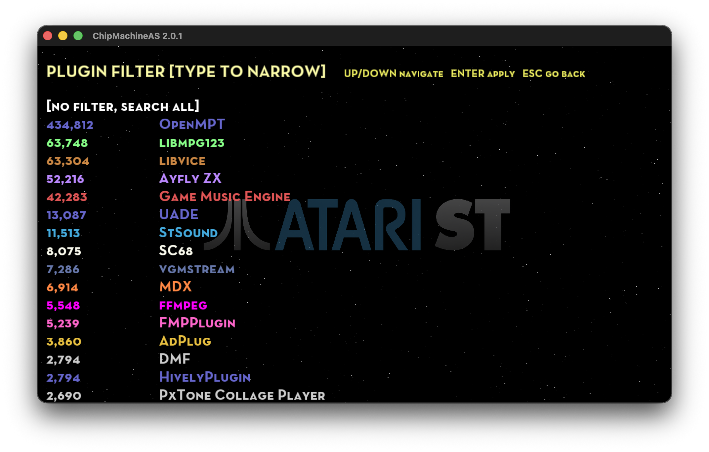
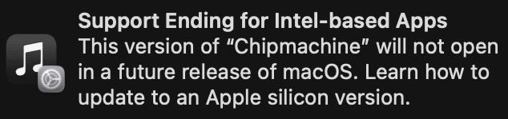

**ChipMachineAS**

<div align="right">
  
</div>

**Port of ChipMachine for Apple Silicon**

But this is far more than a simple port!

While ensuring the player runs on modern Apple hardware, my passion for it has expanded its compatibility and scale:

* [60+ plugins](https://github.com/mihailod/chipmachine/tree/master/external/musicplayer/src/plugins) supporting [350+ music formats](data/misc/formats_descriptions.txt)
* [~770,000](data) indexed songs (~100,000 annotaded with screenshots) and counting

**The mission statement: support every single format and index all retro/chip music databases.**

Despite the massive expansion under the hood, the core experience remains untouched: instant, incremental autocomplete search across the entire global library, delivering instant zero-latency (for cached songs) playback from a single, simple, unified interface.

**(Screenshots might show features from dev in progress (not released) code.)**
[](https://youtu.be/WsNhwxY1c08)
[](https://youtu.be/WsNhwxY1c08)
[](https://youtu.be/WsNhwxY1c08)
[](https://youtu.be/WsNhwxY1c08)
[](https://youtu.be/WsNhwxY1c08)
[](https://youtu.be/WsNhwxY1c08)

## Intro

*A demoscene/retro Jukebox/spotify-like music player*

* **Simply start typing for incremental auto-complete search of the aggregated database**
* **UP/DOWN keys = select a song from search results**
* **ENTER key = play**
* **TAB key = help screen**
* **(Read the scrolling text for more info)**
* **[Things in progress / to come](data-notbundled/misc/TOODOO.txt)**
* **Ultimate goal: every chiptune ever made searchable and instantly playable!** 

## Binaries

Binaries for macOS (tested on Tahoe) are available under [*Releases*](https://github.com/mihailod/chipmachine/releases)

**NOTE although not formally tested, ChipMachineAS should work on pre-Tahoe macOS**

### Running on Mac (Gatekeeper Authorization)

For now, the app is distributed with an ad-hoc code signature and macOS Gatekeeper will block it (official Mac App Store release coming soon).

This is standard behavior for open-source binaries distributed outside the official Mac App Store ecosystem.

To authorize and run the application on your Mac, follow these steps:

1. Download the latest release and unzip it in the Applications folder
2. Double-click `ChipMachineAS.app`.
3. macOS will display a prompt stating the app cannot be opened because the developer cannot be verified.
4. Click **Done** or **Cancel**.
5. Open your Mac's **System Settings**.
6. Navigate to **Privacy & Security** in the left sidebar
7. Scroll down to the **Security** section.
8. Look for the notification stating: `“ChipMachineAS” was blocked from use because it is not from an identified developer.`
9. Click the **Open Anyway** button.
10. Authenticate using your Mac's admin password or Touch ID.
11. Double-click `ChipMachineAS.app` again.
12. The final confirmation prompt will appear.
13. Click **Open**.

*Note: You only need to perform this authorization once per release. Subsequent launches will boot instantly.*

### Opening local music files

Once installed, ChipMachineAS registers with macOS as a player for the hundreds of formats it supports, and you can open a local song three ways:

* **Right-click a file → Open With → ChipMachineAS** (or double-click a file you've made it the default for)
* **Drag and drop a file onto the ChipMachineAS icon** (Dock or Finder)
* **Drag and drop a file straight into the running ChipMachineAS window**

All three play the track immediately.

This is deliberately polite — ChipMachineAS advertises itself as an *alternate* handler and never hijacks files from a player you already use:

* For common audio types (`.mp3`, `.wav`, `.flac`, …) it appears as an option in **Open With** but never becomes the default unless you explicitly choose it via **Get Info → Open with → Change All**.
* For obscure chip/tracker formats that nothing else on your Mac opens, it becomes the de-facto player and shows its own document icon in Finder.

## Prerequisites for development (Tested on macOS 26 / Tahoe only)

* Make sure you have Homebrew installed (Apple Silicon homebrew in /opt/homebrew/ , make sure you are not using Intel legacy /usr/local tools)
* brew install git cmake ninja freetype glew glfw3 lua fftw mpg123 python ffmpeg boost
* (if some packages are reported missing later install then via brew and let me know -- I missed them in the line above!)

## Building for Apple Silicon

All third-party dependencies are **vendored inside the repo** under [external/](external/), so a single clone is all you need. Provenance (each vendored fork's upstream URL and commit) is recorded in [external/VENDORED.md](external/VENDORED.md).

```bash
git clone https://github.com/mihailod/chipmachine.git
mkdir build && cd build
cmake ../chipmachine -GNinja -DCMAKE_BUILD_TYPE=Release
ninja
```

#### Build variants: Plus vs Mac App Store

The default `build/` above produces the full **ChipMachinePlus** variant — everything included (YouTube, self-update), distributed via GitHub with a Developer ID signature. A second **Mac App Store** variant — **ChipMachine** — is built from its own directory by passing `-DCM_VARIANT=mas` (from the workspace root, i.e. the parent of `chipmachine/`):

```bash
cmake -S chipmachine -B build-mas -GNinja -DCMAKE_BUILD_TYPE=Release -DCM_VARIANT=mas
ninja -C build-mas
```

The two are **independent build trees** (each has its own objects and binary) sharing one source — pass `-GNinja` for `build-mas` too, or `ninja` there will have no `build.ninja`. The `mas` variant compiles out everything the App Store disallows or that has no in-sandbox form:

* the **YouTube** plugin and its ~32k catalog rows (yt-dlp is a spawned executable — App Store §2.5.2),
* the bundled **yt-dlp** helper,
* **UADE**, **VICE**, **GoatTracker v2**, **Furnace** (the DefleMask `.dmf` plugin), **mdxmini** (the Sharp X68000 `.mdx` player), **SC68**, **ASAP**/PokeyNoise, **AOSDK**, **Highly Theoretical**, **vio2sf**, **USF**, **Ayfly** and **ZXTune**, together with the `data/uade`, `data/c64` and `data/sc68` payloads that go with them — dropping Furnace is also what clears **reSIDfp** from the build, and dropping VICE is what removes Commodore's copyrighted KERNAL/BASIC/chargen ROM images (Compute!'s Sidplayer `.mus`/`.str` survives regardless, via the **ChipMachine Clean Room SIDPlayer** plugin),
* the **GitHub self-update** check (updates come through the App Store).

Why each of those is excluded — the exact terms, what it costs, and whether a replacement exists — is documented per component in [`LEGAL-PLUS`](./LEGAL-PLUS). The build gates themselves are `CM_HAVE_*` in [CMakeLists.txt](CMakeLists.txt).

Dropping those engines costs formats, so the catalog hides what the build cannot play (see [not_supported_extensions.txt](data/misc/not_supported_extensions.txt), `songHasNoPlayer()` and `songFormatHasNoPlayer()`): the Amiga custom-replayer formats UADE alone handled, the 104 GoatTracker `.sng` songs, the 2,071 DefleMask `.dmf` songs, and all 6,913 Sharp X68000 `.mdx` songs. Where an extension covers several formats, only the affected one is hidden: the 723 X-Tracker `DDMF` `.dmf` songs and every non-GoatTracker `.sng` keep playing, because the gate keys on the *format name*, not the extension. `.mdx` is the opposite case and needs no format key — nothing else claims the extension, so the plain extension test drops all of it.

The C64 formats are **almost** unaffected. The ~6.5k Compute!'s Sidplayer `.mus`/`.str` tunes play via the clean-room **ChipMachine Clean Room SIDPlayer** plugin, and ~59.9k of the ~62k `.sid` tunes via the permissively-licensed **cSID** engine. The exception is an RSID whose header play address is `$0000`: it installs its own IRQ/NMI handler and expects a real C64 (KERNAL banked in, CIA and raster running), which cSID does not emulate, so it renders as dead air. Those are enumerated **by measurement** in [csid_silent_sids.txt](data/misc/csid_silent_sids.txt) and dropped at index time in the MAS build only, so no unplayable row ever surfaces.

The list is measured rather than inferred, because the obvious rule would be badly wrong. Every `play=$0000` file was rendered through the same engine and the same 3 s / peak>64 test the player uses at runtime:

| | files | wholly silent | wholly fine | mixed subtunes |
|---|---|---|---|---|
| RSID `play=$0000` | 3708 | 2363 | 1242 | 103 |
| PSID `play=$0000` | 109 | 19 | 90 | — |

So hiding every `play=$0000` RSID would have hidden **1,345 files that play perfectly well**. Only the 2,382 wholly-silent ones are listed; the mixed files stay indexed and the runtime probe in `CSIDPlugin` skips their silent subtunes one at a time. **Plus is unchanged** — it plays all of them through VICE and never reads the list.

It runs **App-Sandboxed**, with a distinct bundle id (`org.mihailod.chipmachine`) and its own cache/database/index, so Plus and MAS never share state. Per-variant product identity (name, bundle id, artifact) is the single source of truth in [variants.conf](variants.conf); the compile-time switch is `CM_VARIANT` / the `CM_MAS` define.

* Running the app (from the build folder): ./chipmachine (-h for all options)
* Running the tests (from the build folder): ./cmtest
* Packaging the app: [package_app.sh](package_app.sh) `--buildapponly` — rebuilds the `chipmachine` target (incremental), bundles the runtime assets, generates the `Info.plist` with file associations, ad-hoc code-signs and zips the `.app`. Run with no args for full usage; add `--applesign` to produce a Developer ID / notarized build (see [Signing & distribution](#signing--distribution-developer-id) below). Defaults to the **Plus** variant; add `--mas` to package the Mac App Store build (`ChipMachine.app` / `.pkg` from `build-mas/` — see [Mac App Store build](#mac-app-store-build-mas-variant)).
* AI tools used to help with the porting: Claude, Gemini, Antigravity, Codex

### macOS file associations (developer notes)

The `.app` advertises the formats it can play as macOS file associations (see the [user-facing note above](#opening-local-music-files)). All the platform-native macOS glue lives under [src/macnative/](src/macnative/):

* **`gen_info_plist.sh`** — the single source of the bundle's `Info.plist`. It builds the file-association document types from three inputs: `extensions.txt` (the playable-extension union — `package_app.sh` dumps the real, variant-specific list from the freshly-built binary into `$BUILD_DIR/extensions.txt` and passes it with `--exts`; the copy checked in under `src/macnative/` is the plus superset, used by `dev_update_doctypes.sh` and as a fallback, and is refreshed by hand), `MacOSSystemTypeExtensions.txt` (formats with an existing system UTI — referenced politely at `LSHandlerRank=Alternate`, never redefined) and `MacOSHandlerDenyList.txt` (non-extension junk / dangerous tokens to drop). Everything else is exported under one umbrella UTI (`org.mihailod.chipmachineplus.chiptune`) with the app's document icon. The last two `.txt` files are hand-editable.
* **`FileOpenHandler.mm`** — patches GLFW's app delegate (`GLFWApplicationDelegate`) at runtime to implement `application:openURLs:`, so double-click / "Open With" / icon drag-and-drop actually play the file (Finder does **not** pass files on `argv`, and this must win the race against GLFW's own `[NSApp run]` inside `glfwInit()`). Dropping a file into the running window instead goes through GLFW's native `glfwSetDropCallback` (wired in the vendored `external/apone/mods/grappix`) — cross-platform, no Apple Event involved. Both paths feed the same play queue.
* **`dev_update_doctypes.sh`** — fast, no-recompile test loop: rewrites the `Info.plist` in an existing bundle, re-signs it and re-registers it with LaunchServices in a couple of seconds. Pass `--with-binary` to also swap in the freshly-built executable and test double-click playback end-to-end. Run with `--help` for full usage.

`package_app.sh` invokes the generator automatically, so a normal release needs no extra steps.

### Signing & distribution (Developer ID)

[package_app.sh](package_app.sh) requires an explicit action flag (run it with no
arguments to see full usage):

| Command | Result |
| --- | --- |
| `./package_app.sh --buildapponly` | Build `.app` + zip, **ad-hoc self-signed** (local/dev; Gatekeeper blocks it on other Macs). |
| `./package_app.sh --applesign --signid="Developer ID Application: Name (TEAMID)"` | Build, then **Developer ID sign** with Hardened Runtime + entitlements. |
| `… --notaryprofile=NAME` | Additionally **notarize with Apple and staple** the ticket. |
| `… --reusebuiltapp` | **Skip the build** and (re)sign the `.app` already on disk — the fast re-sign / re-notarize loop. Requires `--applesign`; can't combine with `--buildapponly`. |
| `… --releaseit` | After packaging, interactively create a GitHub release (works with either mode). |

Flags accept a single or double dash and are case-insensitive; value flags use
`--key=value`.

**Why notarization matters:** a Developer ID signature *alone* is not enough.
Since macOS 10.15, a downloaded (quarantined) app must also be notarized by Apple
and have the ticket stapled, or Gatekeeper blocks it with "cannot be checked for
malicious software." Signing + notarizing + stapling are all covered by the same
Apple Developer Program membership and use the free `notarytool` — this is **not**
Mac App Store review. Only the full `--applesign … --notaryprofile=…` build opens
with no warning on other people's Macs.

**One-time setup** (after joining the Apple Developer Program and installing a
*Developer ID Application* certificate in the login keychain):

1. Find your identity string:
   ```bash
   security find-identity -v -p codesigning
   # -> "Developer ID Application: Your Name (ABCDE12345)"
   ```
2. Store a notarization credential profile once (the app-specific password / API
   key lives in the keychain, never on the command line):
   ```bash
   xcrun notarytool store-credentials chipmachine-notary \
       --apple-id you@example.com --team-id ABCDE12345
   ```

**Full distributable build:**

```bash
./package_app.sh --applesign \
  --signid="Developer ID Application: Your Name (ABCDE12345)" \
  --notaryprofile=chipmachine-notary
```

**Entitlements** live in [src/macnative/](src/macnative/) and are documented in
[entitlements-README.md](src/macnative/entitlements-README.md): the main
executable and the bundled yt-dlp helper each get
`com.apple.security.cs.disable-library-validation` (the helper is a PyInstaller
Python freeze that fails library validation under Hardened Runtime otherwise).
No JIT entitlements are needed — the app links vanilla Lua, not LuaJIT. The
entitlements plists are intentionally comment-free: macOS's kernel entitlement
parser (AMFI) rejects XML comments.

### Mac App Store build (MAS variant)

The Mac App Store variant is packaged with `--mas`, which builds from `build-mas/`
(configure it once with `-DCM_VARIANT=mas`, see [Build variants](#build-variants-plus-vs-mac-app-store)),
skips the yt-dlp helper, applies the App-Sandbox entitlements, and produces a
signed `.pkg` instead of a zip.

| Command | Result |
| --- | --- |
| `./package_app.sh --mas --buildapponly` | Build `ChipMachine.app`, **ad-hoc-signed but sandboxed** — a local test build. No certificates needed. |
| `./package_app.sh --mas --applesign --distribid="Apple Distribution: Name (TEAMID)" --installerid="3rd Party Mac Developer Installer: Name (TEAMID)" --provision=/path/to/ChipMachine.provisionprofile` | Build, sign for the App Store, embed the provisioning profile, and emit a signed **`.pkg`** for upload. |

The three signing inputs (`--distribid`, `--installerid`, `--provision`) require
the paid **Apple Developer Program** plus an App Store Connect record for the
bundle id `org.mihailod.chipmachine`. Upload the resulting `.pkg` with
**Transporter.app** or `xcrun altool --upload-app`. There is **no zip and no
notarization** for this variant — the App Store handles review and signing.

MAS **entitlements** are in [entitlements-app-mas.plist](src/macnative/entitlements-app-mas.plist):
`com.apple.security.app-sandbox` + `com.apple.security.network.client` (outbound
only — the app runs no listening server; it deliberately does **not** declare
`network.server`). No `disable-library-validation` and no yt-dlp helper, since the
MAS build ships neither.

> Not yet wired for a live submission: the app still needs **file-access sandbox
> entitlements** (`com.apple.security.files.user-selected.read-only` plus
> security-scoped bookmarks) for the double-click / "Open With" path to work under
> the sandbox. `--mas --buildapponly` is fully usable for local testing today.

## Using the application

* Type words separated by spaces for incremental search
* *ENTER* to play, *SHIFT-ENTER* to enque
* *F1* = Player screen, *F2* = Search screen
* *F5* = Play/Pause
* *F9* = Advanced search: set/reset search filter by platform (ie. Amiga)
* *F6* = Next Song (or *ENTER* from Player Screen)
* *ESC* = Clear search field
* *SHIFT-ESC* = Quit
* *F7* = Toggle Favorite
* Type _shoutcast_ to see the radio-stations
* [Things in progress / to come](data-notbundled/misc/TOODOO.txt)

## Data Sources

### Chip Music Collections

Metadata from these databases is ingested, normalized, deduped and cross-checked for screenshots.

* Modland - https://ftp.modland.com
* High Voltage SID collection - https://www.hvsc.c64.org
* Gamebase64 - http://www.gb64.com
* AMP (Amiga Music Preservation) - http://amp.dascene.net
* RKO - http://remix.kwed.org
* Atari ST (SNDH) - http://sndh.atari.org
* SNES Music - http://snesmusic.org
* Atari SAP (ASMA) - http://asma.atari.org
* HVTC (High Voltage TED Collection) - http://plus4world.powweb.com
* NSFE (Famicompo mini NSFE archive of 1,228 songs from https://forums.nesdev.org/viewtopic.php?t=21128)
* Mod Archive - https://modarchive.org
* Bitworld - http://janeway.exotica.org.uk
* Exotica - https://www.exotica.org.uk
* CSDb - https://csdb.dk
* ZX Art - https://zxart.ee/eng/music
* CPC-Power - https://www.cpc-power.com
* Zophar's Domain - https://www.zophar.net
* Vampi's MDX Collection (Sharp X68000) - https://mdx.vampi.tech
* Demozoo - https://demozoo.org
* Scene.org - https://scene.org
* OPL Archive - https://opl.wafflenet.com
* Bulba's ZX Spectrum & Amstrad CPC AY/YM Music Archives - https://bulba.untergrund.net/music_e.htm
* VGMRips - https://vgmrips.net
* ZX TUNES - https://zxtunes.com
* SMS POWER! - https://www.smspower.org
* MirSoft - http://www.mirsoft.info
* Chipmusic - https://chipmusic.org
* Battle of the Bits - https://battleofthebits.org
* keygenmusic (Internet Archive) - https://archive.org/details/keygen-music-2020-03-pack

### Remixes / Recordings / Streaming (mp2/mp3/ogg/flac/wav/aif/aiff/opus)

* Pouët.net - https://www.pouet.net
* Amiga Remix (MP3) - http://amigaremix.com
* OverClocked ReMix (MP3) - https://ocremix.org
* Sounds of Scenesat - https://scenesat.com
* Demozoo -- https://demozoo.org

### Youtube Audio
* Pouet - https://www.pouet.net

### Podcasts

Press *F9* and pick **Podcasts** to browse/filter only podcast episodes.
Shows backed by a live RSS feed ship with
a snapshot of their back catalogue and are refreshed from the feed in the
background at startup (throttled to roughly once a day), so newly published
episodes are merged in automatically without a full re-index.

* C64 Take-away — Commodore 64 remixes & original SID (complete, ended 2025) - https://c64takeaway.com
* This Week in Chiptune — chiptune mixes (Dj CUTMAN, 2013–2017 archive) - https://thisweekinchiptune.com
* Pixelated Audio — video game music & interviews - https://pixelatedaudio.com
* GameFuel — video game music (KNGI Network) - https://kngi.org
* Nitro Game Injection — video game music & remixes (KNGI Network) - https://kngi.org
* Demovibes — demoscene music - https://www.demovibes.org
* AmigaVibes — Amiga & demoscene music - http://www.amigavibes.org
* Syntax Error — game & demoscene music (Sol) - http://www.syntaxerror.nu

And one not related to retro music but dear to my heart so here it is:

* Completely Unnecessary Podcast — retro gaming (Pat "The NES Punk" Contri & Ian Ferguson) - https://cupodcast.podbean.com

### Shoutcast Radio Streams

* Scenesat - https://scenesat.com
* SLAY Radio - https://www.slayradio.org
* Nectarine - https://scenestream.net
* VGM Radio - http://vgmradio.com
* NoLife-Radio - https://www.nolife-radio.com
* Rainwave - https://rainwave.cc
* The Sid Station - https://c64radio.com
* Radio PARALAX - https://www.radio-paralax.de
* CVGM Radio - https://radio.cvgm.net
* Kohina - https://kohina.com
* Gyusyabu NEC PC-98/Sharp X68000 - http://gyusyabu.ddo.jp

## Music Plugins and supported formats and platforms

### OpenMPT

Support for PC and Amiga tracker formats

* ProTracker, ScreamTracker III, FastTracker II, Impulse Tracker, OpenMPT, ScreamTracker II, NoiseTracker, Soundtracker, Mod's Grave, UltraTracker, Composer 669 / UNIS 669, MultiTracker, OctaMed, Farandole Composer, DigiTracker, Extreme's Tracker, Velvet Studio, DSIK Format, DSMI, ASYLUM, Oktalyzer, X-Tracker, PolyTracker, Epic Megagames, MASI, MadTracker 2, DigiBooster Pro, DigiBooster, Imago Orpheus, Galaxy Sound System
* **New with the 0.8.7 upgrade:** Symphonie / Symphonie Pro (Amiga "pseudo-DAW" with software mixer + real-time echo DSP), Digital Symphony, Face The Music, Graoumf Tracker 1 & 2, TCB Tracker, Real Tracker, Astroidea XMF, Composer 667, EasyTrax, FM Tracker, CBA

Extensions: `.mod` `.xm` `.it` `.s3m` `.mptm` `.stm` `.nst` `.m15` `.stk` `.wow` `.ult` `.669` `.mtm` `.med` `.far` `.mdl` `.ams` `.dsm` `.amf` `.okt` `.omf` `.dmf` `.mt2` `.dbm` `.digi` `.imf` `.j2b` `.gdm` `.umx` `.mo3` `.symmod` `.dsym` `.dsyn` `.dysn` `.ftm` `.gt2` `.gtk` `.tcb` `.rtm` `.xmf` `.667` `.etx` `.fmt` `.cba` `.c67` `.fst` `.ice` `.mmcmp` `.mms` `.mus` `.oxm` `.plm` `.ppm` `.psm` `.pt36` `.ptm` `.sfx` `.sfx2` `.stp` `.stx` `.xpk`

(`.mus`, `.psm` and `.stp` are shared extensions: libopenmpt claims them, but a SID `.mus` falls through to the Compute! Sidplayer player — libvice in Plus, ChipMachine Clean Room SIDPlayer in MAS — and a ZX `.psm` to ZXTune, a ZX `.stp` to the ZX Spectrum AY engine. Routing is by content.)

> Note: `.dsm` covers three unrelated DSIK/Dynamic-Studio variants. libopenmpt natively plays the newer DSIK "RIFF" format (`RIFF…DSMF`) and Dynamic Studio (`DSm`), but not the original DSIK "old" Internal Format (`DSM` + 0x10, e.g. the Necros tunes). Support for that v1 variant was added in a local patch to the vendored libopenmpt `Load_dsm.cpp`, with the loader adapted from MilkyTracker's `LoaderDSMv1` (BSD-3-Clause).

> Note: `.dsyn` and `.dysn` are **Digital Symphony** under modland's misspelled extensions. Almost all of the `Digital Symphony/` corpus is `.dsym` (which libopenmpt advertises), but 8 files in one composer dir are named `.dsyn`/`.dysn` and so routed to no plugin at all. The bytes are ordinary Digital Symphony, and libopenmpt's `Load_dsym` decodes them unchanged, so `OpenMPTPlugin::canHandle` claims both spellings — gated on the loader's own magic (`\x02\x01\x13\x13\x14\x12\x01\x0B`), so a misnamed non-DSym file skips cleanly instead of hard-failing.

> Note: `.omf` (**Onyx Music File**) is a MOD-like Amiga format from the 1993 musicdisk *Jangle* by Onyx (the modland `Onyx Music File/` corpus, 24 tunes). It never had a standalone replayer — the tunes were only playable through the original musicdisk executable. Playback reuses libopenmpt's existing MOD engine.

> Note: some Amiga formats libopenmpt can also decode (Future Composer, Puma, Game Music Creator, Images Music System, etc.) are intentionally routed to the **UADE** plugin instead, which uses the original 68k replayers — see the UADE section below.

### High Technology

Support for Dreamcast and Sega Saturn music

Extensions: `.ssf` `.dsf` `.minissf` `.minidsf`

> **ChipMachinePlus only.** The engine is Neill Corlett's SegaCore as maintained
> in kode54's *Highly Theoretical*; it is not part of the App Store build and
> those 273 songs are hidden there. A clean-room is conceivable — the CPU
> halves are already available permissively — but SCSP/AICA is a 32/64-channel
> Yamaha part with a real DSP, i.e. an emulator project. See [`LEGAL-PLUS`](./LEGAL-PLUS).

### Highly Experimental — removed

Playstation 1 & 2 music (`.psf` `.psf2` `.minipsf` `.minipsf2`) used to be
decoded here. This plugin has been **deleted**. It could not start without a
real Sony PlayStation 2 BIOS image, and the copy this project was shipping
(`data/hebios.bin`, 512 KB of Sony Computer Entertainment firmware) was not ours
to redistribute; it is gone from the tree and from both bundles. With no BIOS the
engine decoded nothing, and it carried no licence of its own, so there was
nothing worth keeping. The full write-up is in [`LEGAL-PLUS`](./LEGAL-PLUS).

**No songs were lost.** All four extensions moved to **AudioOverload** below,
whose PS1/PS2 engines are HLE and need no BIOS. Checked over ~100 modland rips
with `cm --dump-metadata`: every file Highly Experimental could load, AOSDK
loads.

### NDS

Support for Nintendo DS music

Extensions: `.2sf` `.mini2sf`

### Game Music Emulator

Support for various 8 bit console music

* ZX Spectrum, Amstrad CPC, Nintendo Game Boy, Sega Genesis, Mega Drive, NEC TurboGrafx-16, PC Engine, MSX Home Computer, other Z80 systems, Nintendo NES, Famicom (with VRC 6, Namco 106, and FME-7 sound), Atari systems using POKEY sound chip, Super Nintendo, Super Famicom, Sega Master System, Mark III, Sega Genesis, Mega Drive, BBC Micro

Extensions: `.spc` `.nsf` `.nsfe` `.gbs` `.gbr` `.ay` `.gym` `.sap` `.vgm` `.vgz` `.hes` `.kss` `.sgc` `.emul`

> `.gbr` is the older Game Boy rip format (predecessor of `.gbs`).
> GBR carries no "first song" field and many rips keep a silent stop-track
> at song 0 — use the subsong controls (LEFT-RIGHT cursor keys) if a tune starts silent.

### SNDH (AtariAudio)

Support for Atari ST/STE music in the SNDH archive format, via **AtariAudio** by
Arnaud Carré (Leonard/Oxygene) — a self-contained ST machine (Musashi 68000 +
YM2149 + MFP timers + STE DMA sound + an ICE! depacker).

Extensions: `.sndh` `.snd`

> This replaced SC68 as the `.sndh` decoder in both builds. It also fixes STE
> DMA-sound tunes that SC68 played as a single block and then silence.

### SC68

Support for Atari 16 bit music in the `.sc68` container format

Extensions: `.sc68` `.sndh` `.snd` `.4v`

> **ChipMachinePlus only.** SC68 is not part of the App Store build (see
> [`LEGAL-PLUS`](./LEGAL-PLUS)); `.sc68` songs are hidden there. `.sndh` is unaffected — SNDH above plays
> it in both builds, and takes priority here too, leaving SC68 as a fallback.

### USF

Support for Nintendo 64 music

Extensions: `.usf` `.miniusf`

### StSound

Support for Atari ST YM2149 register-dump music (`.ym`), by **Arnaud Carré**
(Leonard/Oxygene) — the same author as the SNDH plugin's AtariAudio engine.

Extensions: `.ym` `.mix`

### ADplug

Support for retro audio format hardware simulation

* AdLib Tracker 2 by subz3ro, AdLib MIDI Music Format by Ad Lib Inc., AdLib MIDIPlay File by Ad Lib Inc., AdLib MSCplay, AdLib Visual Composer by AdLib Inc., AMUSIC Adlib Tracker by Elyssis, Apogee IMF File Format, Beni Tracker (PIS), Bob's Adlib Music Format, BoomTracker 4.0 by CUD, Coktel Vision AdLib Music, Creative Music File Format by Creative Technology, DeFy Adlib Tracker by DeFy, Digital-FM by R.Verhaag, DOSBox Raw OPL Format (v0.1 and v2.0), Easy AdLib 1.0 by The Brain (BMF), eXotic ADlib Format by Riven the Mage (incl. Flash, Hybrid, Hypnosis, PSI, rat), eXtra Simple Music by Davey W Taylor, God of Thunder Music by Roy Davis (Adept Software), Herbulot AdLib System / HERAD by Remi Herbulot, HSC Adlib Composer by Hannes Seifert, HSC-Tracker by Electronic Rats, HSC Packed by Number Six / Aegis Corp., JBM Adlib Music Format, 
Ken Silverman's Music Format, LOUDNESS Sound System, LucasArts AdLib Audio File Format by LucasArts, Master Tracker, MIDI Audio File Format, MKJamz by M \ K Productions, 
Mlat Adlib Tracker, MPU-401 Trakker by SuBZeR0, Note Sequencer by Lee Ho Bum (sopepos), Origin AdLib Music Format (Ultima 6), Packed EdLib by Vibrants, PALLADIX Sound System, RdosPlay RAW file format by RDOS, Reality ADlib Tracker by Reality (incl. RAD v2), Screamtracker 3 by Future Crew, Sierra's AdLib Audio File Format, Softstar RIX OPL Music Format, Surprise! Adlib Tracker by Surprise! Productions, Surprise! Adlib Tracker 2 by Surprise! Productions, Twin TrackPlayer by TwinTeam, Westwood ADL File Format, XMS-Tracker by MaDoKaN/E.S.G, 

Extensions: `.a2m` `.a2t` `.adl` `.adlib` `.agd` `.amd` `.as3m` `.bam` `.bmf` `.cff` `.cmf` `.d00` `.dfm` `.dmo` `.dro` `.dtm` `.got` `.ha2` `.hsc` `.hsp` `.hsq` `.imf` `.jbm` `.ksm` `.laa` `.lds` `.m` `.mad` `.mdi` `.mdy` `.mid` `.mkf` `.mkj` `.msc` `.mtk` `.mtr` `.pis` `.plx` `.rac` `.rad` `.raw` `.rix` `.rol` `.sa2` `.sat` `.sci` `.sdb` `.snd` `.sop` `.sqx` `.wlf` `.xad` `.xms` `.xsm`

> Note: `.s3m` is exposed as `.as3m` (the AdLib variant) so it doesn't clash with OpenMPT; `.sng`, `.ims`, `.mus` and `.vgm`/`.vgz` are intentionally routed to UADE / the Compute! Sidplayer player (Vice in Plus, ChipMachine Clean Room SIDPlayer in MAS) / GME instead.

### MP3

Support for MP3 music

Extensions: `.mp3`

### cSID

Support for Commodore C64 music (the 6581/8580 SID chip, including 2SID/3SID tunes)

Extensions: `.sid` `.rsid`

### Vice

Support for Compute!'s Sidplayer — a C64 *note* format with its own player, not a
SID-chip dump. A stereo tune is a `.mus` (voices 1–3) plus a `.str` companion
(voices 4–6), which the plugin loads together. **Plus build only** — see
[Build variants](#build-variants-plus-vs-mac-app-store); the Mac App Store build
plays the same formats through **ChipMachine Clean Room SIDPlayer** below.

Extensions: `.mus` `.str`

### ChipMachine Clean Room SIDPlayer

The same Compute!'s Sidplayer formats, played by a **clean-room** sequencer over
the cSID chip emulation instead of VICE — which is what lets the Mac App Store
build play these ~6.5k songs at all. Written from two freely-distributed format
write-ups in the Compute's Gazette SID Collection; no third-party player source
was consulted.

The two documents describe the *encoding* but not the *behaviour*, so thirteen
rules were recovered by comparing our SID register writes against an emulator's,
on a 1 ms grid — among them the CIA-driven tick rate, the truncated NTSC note
table, the default tempo, a two-tick startup delay, `HED` as a total play count,
`UTL` explicit note lengths, zero-length events, `AUT` filter-tracking, and the
pulse, filter and portamento sweeps. Where a rule could not be recovered from
output alone it was left unimplemented and written up as a known gap rather than
guessed at.

Validated over the whole CGSC archive: **all 16,601 files render** with no
crashes, hangs or parse failures, and register agreement with the reference has a
**median of 98.5%**. See
[musplugin/README.md](external/musicplayer/src/plugins/musplugin/README.md) for
the derivation and the remaining gaps.

Registered *after* Vice, so the Plus build is unchanged and keeps using VICE.

Extensions: `.mus` `.str`

### Hively

Support for AHX and HVL amiga music

Extensions: `.ahx` `.hvl`

### RSN

Support for RAR packed music (primarily SNES)

Extensions: `.rsn` `.rps` `.rdc` `.rds` `.rgs` `.r64`

### ZX Spectrum AY

ZX Spectrum AY-3-8912 tracker music — at 67,305 songs, the largest single format family in the catalog. Two engines cover it, and which one you get depends on the build.

**ZX AY** is the engine written for this project, with no copyleft anywhere in the chain, and it is present in **both** builds. It plays each format by whichever of three routes suits it:

* **The tracker's own ZX Spectrum replay routine**, run on an emulated Z80 (the same GME core the Beepola and Sam Coupé players use) with its `OUT`s to `#FFFD`/`#BFFD` fed into **Ayumi**, Peter Sovietov's AY-3-8910 emulation. This is how `.pt1`, `.pt2`, `.pt3`, `.vt2`, `.psc` and `.ftc` play. Running the original code is the point: each of these formats has exactly one authoritative definition — the author's own player — and that is where the version-gated fixups, portamento variants and table quirks actually live. The routines are Sergey Bulba's published players; see `zxayplugin/players/PROVENANCE.md`.
* **A sequencer written from the published format description**, where no redistributable ZX player exists: `.stc` (and the `.zxs` / `.st13` files that are the same format under another name), `.asc`, `.stp` / `.stp2`, `.sqt`, `.psm`, `.gtr`, and the `.fxm` / `.amad` bytecode.
* **No player at all** for `.vtx` and `.psg`, which are not modules but recorded AY register streams — the file *is* the register writes. `.vtx` is LH5-packed, the same packing the `.ym` files elsewhere in this app use. `.st11` needs no player either, for a different reason: it is an *uncompiled* Sound Tracker module, so it is compiled into the ordinary `.stc` layout on load and handed to the Sound Tracker sequencer above — which is precisely what the tracker's own "ST COMPILE" did on the Spectrum.

**Ayfly** and **ZXTune** both remain in the Plus build only (see [`LEGAL-PLUS`](./LEGAL-PLUS)), registered ahead of ZX AY, so that build routes every ZX AY song exactly where it always did. The App Store build ships without either.

Four more formats were reclaimed from ZXTune the same way once this machine existed — **Pro Sound Maker** (`.psm`), **Fast Tracker** (`.ftc`), **Sound Tracker 1.1** uncompiled (`.st11`) and **Global Tracker** (`.gtr`), 378 songs — so they too play in both builds. That is every ZXTune format that is actually AY music.

One format gets *better* rather than merely surviving: `.vt2`. Ayfly claimed the extension and then threw on every one of the catalog's 551 rows, which also stopped anything else from trying. Vortex Tracker II's binary save is really a PT3 module wearing a different identifier, so it now plays through Bulba's PTxPlay; the editor's rarer ini-style text export goes to Arkos Tracker 3 via the STarKos plugin. Both builds gain those rows.

`.fxm` is **Fuxoft AY Language** — František Fuka's compiled AY music format ("FXSM" files) — and `.amad` is **AY Amadeus**, the same bytecode in the `ZXAY` container with an `AMAD` type tag, by František Fuka and Patrik Rak. Both rebuild a 64K Spectrum image from the file's origin address and interpret over it as the original Z80 playroutine does.

Extensions: `.psg` `.asc` `.stc` `.psc` `.sqt` `.stp` `.stp2` `.pt1` `.pt2` `.pt3` `.vtx` `.vt2` `.zxs` `.st13` `.fxm` `.amad` `.ftc` `.psm` `.gtr` `.st11`
(`.ay` — the ZXAYEMUL container of raw Z80 rips — belongs to GME in both builds, which plays Amstrad CPC rips that Ayfly renders silent.)

### ZXTune

Additional ZX Spectrum formats. **Plus build only** — the App Store build keeps `.ftc`, `.psm`, `.st11` and `.gtr` through the ZX Spectrum AY engine above, and loses only the two that are not AY music: `.tfe` (TFM Music Maker — TurboSound **FM**, a pair of YM2203s) and `.chi` (Chip Tracker — four channels of **digital samples**).

Extensions: `.st11` `.gtr` `.chi` `.tfe` `.psm` `.ftc`

### MDX

Support for the Sharp X68000 Music Macro Language

**ChipMachinePlus only.** mdxmini is not part of the App Store build, and all
6,913 `.mdx` songs are hidden there — it is the sole claimer of the extension,
so there is no fallback decoder. See the MDX entry in [`LEGAL-PLUS`](./LEGAL-PLUS)
for the terms and for why no permissive replacement exists.

Extensions: `.mdx` (with optional `.pdx` sample banks)

### FMP

Support for NEC PC-98 FMP driver Including the OPNA hardware-rhythm drums

Extensions: `.opi` `.ovi` `.ozi`

### PxTone

Support for PxTone Collage music by Studio Pixel

Extensions: `.ptcop` `.pttune`

### Organya

Support for Organya music by Studio Pixel

Extensions: `.org`

### SunVox

Support for SunVox music by Alexander Zolotov (NightRadio)

Extensions: `.sunvox`

### ProTrekkr / NoiseTrekker

Support for ProTrekkr music by Franck Charlet (Hitchhikr)

Extensions: `.ptk` `.ntk`

### Euphony

Support for FM Towns / PC-98 Eupohony music

Extensions: `.eup`

### MSX

Support for MSX music

Extensions: `.mgs` `.bgm` `.opx` `.mpk` `.mbm` `.mus`

`.mus` is **FAC SoundTracker** (Federation Against Commodore, 1990/1991), the
PSG-plus-sampled-drums MSX tracker. The song is converted on the fly into a KSS
image carrying FAC's own Z80 replay routine and played through libkss; drummed
songs pull in their `<DRUMKIT>.SM1`/`.SM2` sample-bank companions from the same
folder. (The `.sm1`/`.sm2` files are those drumkit banks, not standalone tunes.)

### WonderSwan

Support for Bandai WonderSwan / WonderSwan Color

Extensions: `.wsr`

### PokeyNoise

Support for Atari XL/XE series POKEY chip PokeyNoise music

Extensions: `.pn` (more often `pn.<song>`)

> **ChipMachinePlus only.** ASAP is not part of the App Store build (see
> [`LEGAL-PLUS`](./LEGAL-PLUS)) and those 17 songs are hidden there. Atari 8-bit POKEY music is otherwise
> unaffected — the 6,617-song `.sap` ASMA corpus plays through GME in both
> builds, and 16 of the 17 exist there under the same title and composer
> (Ballblazer, Boulder Dash, International Karate, Draconus, Zybex …).

### S98

Support for retro hardware Music, including OPNA hardware-rhythm drums

Extensions: `.s98`

### ZX Spectrum beeper music: Beepola

Support for Beepola ZX Spectrum 1-bit beeper music. Each `.bbsong` is compiled into its engine's data format and the engine's original Z80 player is run on an in-process Z80 core (48K ROM mapped, IM2 interrupts) while the 1-bit speaker (port `0xFE`) is sampled to PCM. Supported engines: **SFX** (Special FX / Fuzz Click), **Phaser1** (`P1D` `P1S`), **Music Box** (`TMB`), and **Music Studio** (`MSD`). For the Shiru engines the player is assembled in-repo from vendored Z80 source by a small vendored Z80 assembler; for SFX the player and its complete compiled bytecode format (tone, sustain and percussion) are reproduced from Beepola itself (validated byte-for-byte). This covers ~92% of the Beepola songs on modland. Work in progress: the **Savage** engine, and Music Studio's low bass range/percussion.

Extensions: `.bbsong`

### SoundSmith (Apple IIgs)

Support for Apple IIgs SoundSmith music (Huibert Aalbers, 1989) — the dominant IIgs tracker, driving the legendary Ensoniq 5503 "DOC" 32-oscillator chip. The DOC is emulated in-process (a faithful port of Sean Kasun's BSD-licensed player, rendering at the chip's native 26320 Hz.

Extensions: bare song name + `.W` (wavebank)

### Acorn Archimedes Tracker

Support for the native **8-channel** format of Dan Wilson's *!Tracker* (1991), an Amiga-Soundtracker-style editor for the original ARM computer.

Extensions: `.musx`

### Coconizer

Support for **Coconizer**, a sample-based Acorn Archimedes music format (the same VIDC-era family as Archimedes Tracker).

Extensions: `.coco`

### Megatracker (Atari ST)

Support for **Megatracker**, a sample-based Atari ST tracker by Cream.

Extensions: `.mgt`

### SBStudio (MS-DOS)

Support for **SBStudio**, a sample-based MS-DOS tracker by Henning Hellstroem (early 1990s).

Extensions: `.pac`

### Funktracker (MS-DOS)

Support for **Funktracker** by Elias Ehlin (1994-96), shipped as *FunktrackerGOLD* and *Funktracker DOS32* — a sample tracker aimed at funk/hiphop, with 4–32 channels. Playback uses libxmp's `fnk_loader`, compiled as a minimal single-loader slice (the same approach as Archimedes Tracker / Coconizer / Megatracker above).

Extensions: `.fnk`

### MaxTrax (Amiga)

Support for **MaxTrax**, a commercial custom Amiga sound engine (multiple packing subformats)

Extensions: `.mxtx`

### STarKos (Amstrad CPC)

Support for **STarKos**, Targhan / Arkos' AY-3-8912 / YM2149 tracker for the Amstrad CPC (the predecessor of Arkos Tracker).

Extensions: `.sks`

### NerdTracker II (NES / Famicom)

Support for **NerdTracker II**, Michel Iwaniec's MS-DOS tracker for the Nintendo NES / Famicom 2A03 (RP2A03) sound chip — a staple of the early NES chiptune scene before FamiTracker. Played at NTSC speed via blargg's NES APU emulation.

Extensions: `.ned`

### SCC-Musixx (MSX)

Support for **SCC-Musixx**, Tyfoon-Software's 1990 tracker for Konami's SCC wavetable sound chip on the MSX. The original SCC-MUSIXX replay routine runs on an embedded Z80 core, with its SCC register writes driving the emu2212 SCC emulator.

Extensions: `.SNG`

### Sam Coupé (COP)

Support for **Sam Coupé** music (the modland "Sam Coupe COP" corpus) for the Philips SAA1099 sound chip. Each `.cop` file is a SAM Coupé memory image whose Z80 replay routine is either compiled into the song or is the shared E-Tracker player; that original Z80 routine runs on an embedded Z80 core, with its SAA1099 port writes driving Dave Hooper's SAASound emulator. The load and calling convention follow Christopher O'Neill's SCPlayer. (The `.cop` extension is shared with the zxart E-Tracker variant decoded by ZXTune; routing is by content.)

Extensions: `.cop`

### PlayerPRO (Macintosh)

Support for **PlayerPRO**, Antoine Rosset's classic Macintosh tracker — the dominant Mac module editor of the 1990s. Played by a minimal slice of PlayerPRO's own public-domain "MADDriver" software synth, driven offline at 44100 Hz. The `.mad` extension is shared with AdPlug's unrelated Mad Tracker 2 loader, which is content-gated (magic `MAD+`) so PlayerPRO tunes route here.

Extensions: `.mad` (`MADG`/`MADF`/`MADK`)

### JayTrax

Support for **JayTrax** (`.jxs`), Reinier "Rhino" van Vliet's cross-platform software synthesizer + tracker (the engine began as *Mugician*; the desktop/PocketPC apps were *JayTrax* and *Syntrax*). Instruments are samples or synth waveforms shaped by AM/FM/pan/arpeggio modulators, mixed across up to six stereo channels with a stereo echo. Played in-process by the public C port of Rhino's own replayer, rendering at 44100 Hz — not via UADE. The replayer has no explicit upstream license; it was publicly released by the author and is reused by other players (kode54/foobar2000, rePlayer) — see `jaytrax/PROVENANCE.md`.

Extensions: `.jxs`

### Ixalance

Support for **Ixalance** (`.ixs`), an Impulse-Tracker-family format from the (defunct) Shortcut Software Development BV (~2000).

Extensions: `.ixs`

### Monotone

Support for **MONOTONE** (`.mon`), Jim "Trixter" Leonard / Hornet's PC-speaker tracker — up to a dozen square-wave tracks summed into the IBM PC's single 1-bit beeper.

Extensions: `.mon`

### MikMod UNITRK / UNIMOD

Support for **MikMod UNITRK** / **UNIMOD** modules (`.uni`) — MikMod's own on-disk module format (magic `UN0x`, e.g. `UN05`; legacy `APUN`), into which it could save any module it loaded (the modland `MikMod UNITRK/` corpus is mostly FastTracker 2 tunes converted this way). No other engine in the build has a UNIMOD loader (libopenmpt's superficially-similar `Load_unic` is the unrelated *UNIC Tracker*; libxmp and libmodplug have none), so these files previously had no decoder. Played by a vendored slice of **libmikmod** — just the player core, software mixer, UNI loader, depackers and null driver — pulling PCM through libmikmod's virtual mixer. Content-gated to the `UN0x`/`APUN` magic so it claims only `.uni` and never contests the mod-family extensions owned by the OpenMPT/UADE plugins.

Extensions: `.uni`

### FamiTracker (NES / Famicom)

Support for **FamiTracker** modules (`.ftm`), jsr's tracker for the Nintendo NES / Famicom 2A03 (RP2A03) and its expansion chips — the dominant modern tool for new NES chiptunes (the modland `FamiTracker/` corpus). Played in-process by a vendored, boost-free slice of the cross-platform **FamiTracker CX** engine (nukep), driven synchronously at 44100 Hz; the NES APU + VRC6 / VRC7 / MMC5 / FDS emulation renders mono, duplicated to stereo for the host. See `famitracker-cx/PROVENANCE.md`.

The `.ftm` extension is shared with the Atari **Face The Music** format (magic `FTMN`), which the OpenMPT plugin handles; FamiTracker is content-gated to its own magic (`FamiTracker Module`) so the two coexist. Namco 163 (N163) and Sunsoft 5B modules are not yet driven — upstream never wired their channel handlers — and decline gracefully (Skip).

Not in the Mac App Store build (the engine is GPL-2 or later end to end — see [`LEGAL-PLUS`](./LEGAL-PLUS)), so 1,597 rows are dropped from that index. The 95 **Face The Music** `.ftm` rows are OpenMPT's and keep playing in both builds, which is why the drop is keyed on the format name (`formatPlayer` in `MusicDatabase.cpp`) rather than on the extension.

Nothing can be swapped in for the App Store build: every other engine that reads `.ftm` is GPL (0CC-FamiTracker, Dn-FamiTracker, FamiTracker CX itself, Furnace), and FamiStudio is MIT but is a C# importer with its own engine rather than a player — its own docs call the conversion lossy. Rerouting was measured and rejected too: only 42 of the 1,597 rows have a title+composer twin anywhere else in the catalog. A replacement would have to be a driver, not a core swap — the chips themselves are all available permissively (the NSFPlay/xgm cores, `emu2413`, `emu2149`), and those cover the Namco 163 and Sunsoft 5B channels FamiTracker CX never wired, so a from-scratch driver would also pick up the ~175 files that play in neither build today.

Extensions: `.ftm` (FamiTracker; Face The Music `.ftm` routes to OpenMPT)

### vgmstream

Support for **streamed console/PC game audio** — the hundreds of container formats decoded by **vgmstream** (Adam Gashlin, bnnm, Christopher Snowhill and contributors). This covers ripped in-game streams such as CRI **ADX** / **HCA**, FMOD **FSB**, Microsoft **XWB** / **XMA**, and the many platform PCM/ADPCM wrappers (Nintendo **DSP**, PlayStation **VAG**, Sony **AT3** / **AT9**, etc.). The core decode library is vendored at [external/vgmstream/](external/vgmstream/) and driven through its `libvgmstream` API; it is built without any of vgmstream's optional external codec libraries, so only the self-contained decoders are compiled.

vgmstream claims a very large extension set, much of which overlaps formats already handled elsewhere in the build. `canHandle` therefore hard-declines the extensions owned by other plugins (OpenMPT trackers, GME/console chips, FFMpeg streaming audio, the ZX AY players, etc.) and content-validates the rest, so vgmstream only picks up genuinely new game-audio formats.

Extensions: `.adx` `.hca` `.fsb` `.xwb` `.xma` `.dsp` `.vag` `.at3` `.at9` `.acb` `.awb` `.bcstm` `.bfstm` `.brstm` `.genh` `.txth` and roughly 700 more (see vgmstream's full [extension list](external/vgmstream/formats.c))

### AudioOverload

Support for Sega Saturn, Capcom Q and **Playstation 1 & 2** music.

The PSF family arrived here on 2026-08-01, when the Sony PS2 BIOS image that
Highly Experimental needed was deleted from the tree. AOSDK's `eng_psf` /
`eng_psf2` were already compiled into this plugin and simply unreachable — no
extension pointed at them — and unlike Highly Experimental they are **HLE**:
`psx_hw.c` emulates the PS1 BIOS `A0`/`B0`/`C0` vectors and the PS2 IOP kernel in
software, so no BIOS image is involved at any point.

This is now the **only** PSF decoder in the tree — Highly Experimental was
deleted along with the BIOS it needed.

Not in the Mac App Store build (its emulator cores are neither permissively nor
commercially licensed — see [`LEGAL-PLUS`](./LEGAL-PLUS)), so 685 rows are
dropped from that index — 668 Playstation plus the 17 `.spu`/`.miniqsf` that were AOSDK-only
anyway. Saturn `.ssf`/`.minissf` was initially unaffected — **High Technology**
declares a higher priority and owned those — but that plugin has since been
gated too, so Saturn is absent from the App Store build as well.

Extensions: `.ssf` `.minissf` `.qsf` `.miniqsf` `.spu` `.psf` `.minipsf` `.psf2` `.minipsf2`

Known issue, pre-existing and unrelated to the PSF work: `.spu` (raw SPU RAM +
register dumps, 9 songs) loads and steps its register stream but renders
silence. Until 2026-08-01 it appeared to work only because the signature test
never matched — `.spu` rips say `SPU1`, the test looked for `SPU\0` — so no
engine ran and the decoder returned the caller's buffer untouched, which in the
live app is the audio fifo's scratch buffer, i.e. the previous song's tail. It
now correctly returns silence.

### GSF

Support for Gameboy Advance music, on the **mGBA** core. It replaced a vendored
VisualBoyAdvance in 2026; because mGBA is permissively licensed the format keeps
all its songs in the App Store build instead of being gated.

The container loader is ours and spec-derived (`GsfRom.cpp`). One non-obvious
thing it has to get right: mGBA's public `loadROM` picks between the cartridge
and multiboot load paths with a *heuristic* (`GBAIsMB`), which misidentifies
ordinary cartridge rips that happen to be 256 KB or smaller. The GSF program
header says which one it actually is, so the loader sizes the image to force the
correct path — cartridge rips to at least 512 KB, multiboot rips never past
EWRAM. `testmus/gsf/` carries one of each as a regression fixture.

Extensions: `.gsf` `.minigsf`

### UADE

Support for Amiga exotic (Delitracker) formats. The bundled eagleplayers and
format database are vendored from **UADE 3.05** (zakalwe.fi, 2024-10-06), which
adds ~19 new replayers over the previous 2.13-era set (PreTracker, Protracker 4,
TCB Tracker, AProSys, Delta Music 1.3, the Prowizard pack family and more).

* ActionAmics AbyssHighestExperience ADPCM-mono AM-Composer AMOS ArtAndMagic Alcatraz-Packer ArtOfNoise-4V ArtOfNoise-8V AudioSculpture BeathovenSynthesizer BenDaglish BenDaglish-SID BladePacker ChipTracker Cinemaware CoreDesign custom CustomMade DariusZendeh DaveLowe DaveLowe-Deli DaveLoweNew DavidHanney DavidWhittaker DeltaMusic2.0 DeltaMusic1.3 Desire DIGI-Booster DigitalSonixChrome DigitalSoundStudio DynamicSynthesizer EMS EMS-6 FashionTracker FutureComposer1.3 FutureComposer1.4 Fred FredGray FutureComposer-BSI FuturePlayer ForgottenWorlds-Game GlueMon EarAche HowieDavies JochenHippel-CoSo QuadraComposer ImagesMusicSystem Infogrames InStereo InStereo2.0 JamCracker JankoMrsicFlogel JasonBrooke JasonPage JeroenTel JesperOlsen JochenHippel JochenHippel-7V Jochen-Hippel-ST KrisHatlelid Laxity LegglessMusicEditor ManiacsOfNoise MagneticFieldsPacker MajorTom Mark-Cooksey Mark-Cooksey-Old MarkII MartinWalker Maximum-Effect MCMD MED Medley MIDI-Loriciel MikeDavies MMDC Mugician MugicianII MusicAssembler MusicMaker-4V MusicMaker-8V MultiMedia-Sound NovoTradePacker NTSP-system Octa-MED Oktalyzer onEscapee PaulRobotham PaulShields PaulSummers PeterVerswyvelen PierreAdane ProfessionalSoundArtists PTK-Prowiz PumaTracker RichardJoseph RiffRaff RobHubbard SCUMM SeanConnolly SeanConran SIDMon1.0 SIDMon2.0 Silmarils SonicArranger SonicArranger-pc-all SonixMusicDriver SoundProgrammingLanguage SoundControl SoundFactory Sound-FX SoundImages SoundMaster SoundMon2.0 SoundMon2.2 SoundPlayer Special-FX Special-FX-ST SpeedyA1System SpeedySystem SteveBarrett SteveTurner SUN-Tronic Synth SynthDream SynthPack SynTracker TFMX TFMX-1.5-TFHD TFMX-7V TFMX-7V-TFHD TFMX-Pro TFMX-Pro-TFHD TFMX-ST ThomasHermann TimFollin TheMusicalEnlightenment TomyTracker Tronic UFO UltimateSoundtracker VoodooSupremeSynthesizer WallyBeben YM-2149 MusiclineEditor Soundtracker-IV Sierra-AGI DirkBialluch Quartet Quartet-PSG Quartet-ST AProSys Anders-Oland Andrew-Parton Ashley-Hogg GMC Janne-Salmijarvi-Optimizer Kim-Christensen Mosh-Packer Nick-Pelling-Packer Paul-Tonge PreTracker Protracker4 RichardJoseph-Player RobHubbard-ST TCB-Tracker TimeTracker Titanics-Packer ZoundMonitor 

Extensions (matched as a filename prefix or suffix): `.smod` `.lion` `.okta` `.sid` `.ymst` `.jb` `.ast` `.ahx` `.thx` `.adpcm` `.amc` `.nt` `.abk` `.aam` `.alp` `.aon` `.aon4` `.aon8` `.adsc` `.mod_adsc4` `.bss` `.bd` `.BDS` `.uds` `.kris` `.cin` `.core` `.cus` `.cust` `.custom` `.cm` `.rk` `.rkb` `.dz` `.mkiio` `.dl` `.dl_deli` `.dln` `.dh` `.dw` `.dwold` `.dlm2` `.dm2` `.dlm1` `.dm1` `.dsr` `.db` `.digi` `.dsc` `.dss` `.dns` `.ems` `.emsv6` `.ex` `.fc13` `.fc3` `.fc` `.fc14` `.fc4` `.fred` `.gray` `.bfc` `.bsi` `.fc-bsi` `.fp` `.fw` `.glue` `.gm` `.ea` `.mg` `.hd` `.hipc` `.soc` `.emod` `.qc` `.ims` `.dum` `.is` `.is20` `.jam` `.jc` `.jmf` `.jcb` `.jcbo` `.jpn` `.jpnd` `.jp` `.jt` `.mon_old` `.jo` `.hip` `.mcmd` `.sog` `.hip7` `.s7g` `.hst` `.kh` `.powt` `.pt` `.lme` `.mon` `.mfp` `.hn` `.mtp2` `.thn` `.mc` `.mcr` `.mco` `.mk2` `.mkii` `.avp` `.mw` `.max` `.mcmd_org` `.med` `.mmd0` `.mmd1` `.mmd2` `.mso` `.midi` `.md` `.mmdc` `.dmu` `.mug` `.dmu2` `.mug2` `.ma` `.mm4` `.mm8` `.mms` `.ntp` `.two` `.octamed` `.okt` `.one` `.dat` `.ps` `.snk` `.pvp` `.pap` `.psa` `.mod_doc` `.mod15` `.mod15_mst` `.mod_ntk` `.mod_ntk1` `.mod_ntk2` `.mod_ntkamp` `.mod_flt4` `.mod` `.mod_comp` `.!pm!` `.40a` `.40b` `.41a` `.50a` `.60a` `.61a` `.ac1` `.ac1d` `.aval` `.chan` `.cp` `.cplx` `.crb` `.di` `.eu` `.fc-m` `.fcm` `.ft` `.fuz` `.fuzz` `.gmc` `.gv` `.hmc` `.hrt` `.hrt!` `.ice` `.it1` `.kef` `.kef7` `.krs` `.ksm` `.lax` `.mexxmp` `.mpro` `.np` `.np1` `.np2` `.noisepacker2` `.np3` `.noisepacker3` `.nr` `.nru` `.ntpk` `.p10` `.p21` `.p30` `.p40a` `.p40b` `.p41a` `.p4x` `.p50a` `.p5a` `.p5x` `.p60` `.p60a` `.p61` `.p61a` `.p6x` `.pha` `.pin` `.pm` `.pm0` `.pm01` `.pm1` `.pm10c` `.pm18a` `.pm2` `.pm20` `.pm4` `.pm40` `.pmz` `.polk` `.pp10` `.pp20` `.pp21` `.pp30` `.ppk` `.pr1` `.pr2` `.prom` `.pru` `.pru1` `.pru2` `.prun` `.prun1` `.prun2` `.pwr` `.pyg` `.pygm` `.pygmy` `.skt` `.skyt` `.snt` `.snt!` `.st2` `.st26` `.st30` `.star` `.stpk` `.tp` `.tp1` `.tp2` `.tp3` `.un2` `.unic` `.unic2` `.wn` `.xan` `.xann` `.zen` `.puma` `.rjp` `.sng` `.riff` `.rh` `.rho` `.sa-p` `.scumm` `.s-c` `.scn` `.scr` `.sid1` `.smn` `.sid2` `.mok` `.sa` `.sonic` `.sa_old` `.smus` `.snx` `.tiny` `.spl` `.sc` `.sct` `.psf` `.sfx` `.sfx13` `.tw` `.sm` `.sm1` `.sm2` `.sm3` `.smpro` `.bp` `.sndmon` `.bp3` `.sjs` `.jd` `.doda` `.sas` `.ss` `.sb` `.jpo` `.jpold` `.sun` `.syn` `.sdr` `.osp` `.st` `.synmod` `.tfmx1.5` `.tfhd1.5` `.tfmx7V` `.tfhd7V` `.mdat` `.tfmxpro` `.tfhdpro` `.tfmx` `.mdst` `.thm` `.tf` `.tme` `.sg` `.dp` `.trc` `.tro` `.tronic` `.ufo` `.mod15_ust` `.vss` `.wb` `.ym` `.ml` `.mod15_st-iv` `.agi` `.tpu` `.qpa` `.sqt` `.qts` `.ftm` `.sdata` `.dux` `.aps` `.arp` `.ash` `.bye` `.dm` `.hot` `.js` `.kim` `.mod3` `.mosh` `.mus` `.npp` `.pat` `.prt` `.ptm` `.rj` `.sfx20` `.tcb` `.tits` `.tmk`

### TedPlay

Support for Commodore 264 series (16 / 116 / Plus/4) TED chip music

Extensions: `.prg`

### Vic-Tracker (Commodore VIC-20)

Support for **Commodore VIC-20** music (the modland "Vic-Tracker" corpus) in Daniel Kahlin's VIC-TRACKER format. Each `.vt` file is a VIC-20 PRG (a `$3300` load address plus a `T1`/`T0` tune struct) that the tracker's own 6502 replay routine interprets in place; that original routine runs on an embedded 6502 core, with its VIC-I (`$900A`–`$900E`) sound-register writes driving our own emulation of the VIC-20 sound chip. Multi-song tunes are exposed as subsongs.

Extensions: `.vt`

### Klystrack

Support for **klystrack** tunes (the modland "Klystrack" corpus) — chiptunes authored in Tero Lindeman's *klystrack* tracker and rendered by its own *klystron* "cyd" software synth (pulse/saw/noise/triangle oscillators, a wavetable, an FM operator, filters and effects). Each `.kt` file carries a `cyd!song` signature followed by the pattern/instrument data; playback drives the engine's bundled **libksnd** library synchronously, with song length derived from the tracker's own play-time table.

Extensions: `.kt`

### FFMpeg

Compressed and streaming audio — MP3, AAC, M4A/MP4, Ogg/Vorbis, Opus, FLAC, WAV, AIFF, AC3, MP2, WMA and IFF-8SVX — decoded **in-process** by FFmpeg's LGPL `libav*` libraries (no command-line `ffmpeg` is spawned or bundled). Local files, progressive downloads and HTTP(S) radio streams all route here. A decode-only, LGPL build of FFmpeg 8.1.1 is vendored at [`external/ffmpeg-lgpl/`](external/ffmpeg-lgpl/).

Extensions: `.m4a` `.aac` `.mp3` `.mp4` `.ogg` `.opus` `.flac` `.wav` `.aiff` `.aif` `.mp2` `.mpeg` `.ac3` `.wma`

### V2

Support for Farbrausch V2 Synthesizer System modules

Extensions: `.v2` `.v2m`

### YouTube

Streams audio directly from YouTube links (`youtube.com/` / `youtu.be/`). The bundled `yt-dlp` resolves the best audio stream, which is then played back via FFMpeg. This is how the Pouet database plays demoscene production soundtracks.

### Formats we deliberately skip

The collections we index are not curated for us: they carry files that no player in this stack can turn into sound. If those were indexed they would look like ordinary songs, download on ENTER, and then dead-end — so the indexer drops them up front, and the format simply never appears in search. That is why a handful of directories you can see on modland (or a scene.org compo dir) have no entries here.

The list lives in **[`data/misc/not_supported_extensions.txt`](data/misc/not_supported_extensions.txt)** — one extension per line, matched against the extension a song would actually route on. Roughly, the entries are:

* **No open replayer exists.** Closed or undocumented engines where the module carries no sample data and playback needs the original synth — Renoise (`.rns`/`.xrns`), Psycle (`.psy`), Jeskola Buzz (`.bmx`), Sound Club (`.sn`), Picatune (`.smufi`), BeRoTracker (`.brt`), StoneTracker (`.spm`/`.sps`).
* **Not music files at all.** Compo entries submitted as archives (`.arj`, `.lzx`, `.xz`), DAW projects (`.flp`), and executables / ROMs / disk images whose music only exists by *running* the machine — `.exe`, `.d64`, `.nes`, `.gen`, `.tap`. (We play the ripped chip logs — `.nsf`, `.gbs`, `.vgm`, `.sid` — never the parent ROM.)
* **Companion files, not songs.** Sample banks and shared libs that sit next to a tune and are already fetched automatically as secondary files — Quartet's `.set`, PSF2's `.psf2lib`, MusicMaker's `.ip`, stale `.bak` saves.
* **Tested and rejected.** Formats where an engine *looked* like it would work and measurably did not. These carry the evidence inline so the idea is not retried: EdLib `.d01` (AdPlug's D00 loader rejects it two independent ways, even renamed), Liquid Tracker `.liq` (libxmp's loader desyncs on 5 of 13 tunes and `abort()`s the app), 0CC-FamiTracker `.0cc` (~50% unsupported instruments, ~10% hard crash).

Every line is commented with what the format is, what was tried, and what would change the verdict. Entries that are documented but still *playable* stay commented out (they remain indexed) — so the file doubles as the running triage log. If a replayer lands, deleting one line is usually the whole fix.

---

## **Credits**



> ChipMachine is my favorite Mac retro chiptune player and I have been using it forever. However, when opening it on my Mac after a recent macOS update, I saw this annoying popup above. It upset me and I channeled that anger into this project.

This is mostly a preservation effort. I am making this project for myself so I am able to continue enjoying listening to my favorite music in a clean and inspirational way the original Chipmachine was providing to me over many many years.

My work here is mostly based around:

* **Porting**: from Intel to ARM
* **Integration**: with / adding of various new plugins that did not exist in the Intel version
* **Content curation**: updating / adding more songs and fixing their metadata from various databases
* **Administration**: maintenance, releasing, PR merging, support, promoting

**I don't take or imply any credit for the original idea and implementation and actual players development (the hardest part IMO).**

Attribution for the individual emulators, audio players, plugins and core
sub-routines used across this project is maintained as a single source of truth
in the licence notices, **not** here — see [Licensing](#licensing) below.

---

## Licensing

* **ChipMachineAS:** Copyright (c) 2026 Mihailo Despotovic. Licensed under [`PolyForm Noncommercial License 1.0.0.`](./LICENSE)
- 🟢 **Free to use** for personal, educational, research, and non-commercial projects.
- 🔴 **Commercial use prohibited.** If you intend to use my code in any way in any revenue-generating product, contact me for a commercial license.

* **Original ChipMachine Program:** Copyright (c) 2022 Jonas Minnberg. Licensed under the MIT License.
* **Third-party components:** see [`LEGAL`](./LEGAL) — the standalone notice covering everything in the app, and the single source of truth for attribution.
* **ChipMachinePlus extras:** see [`LEGAL-PLUS`](./LEGAL-PLUS) — an addendum to `LEGAL` covering only the copyleft engines the Plus build links and the Mac App Store build does not.

`package_app.sh` assembles the in-app **About** panel (`Credits.rtf`) from those
same two files, so the app, the repo and the release always agree: the Mac App
Store bundle gets `LEGAL`, the Plus bundle gets `LEGAL` + `LEGAL-PLUS`.
